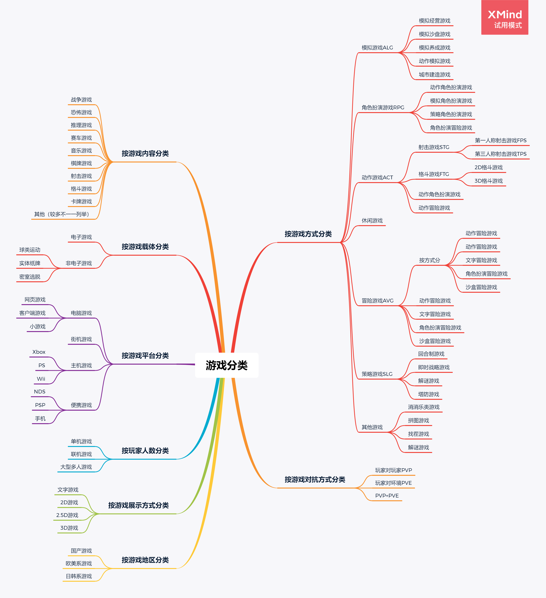
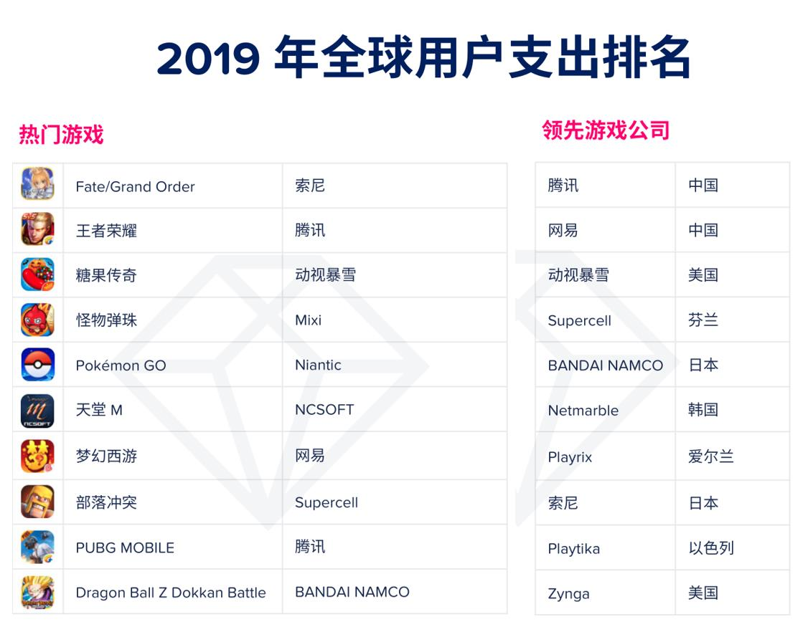
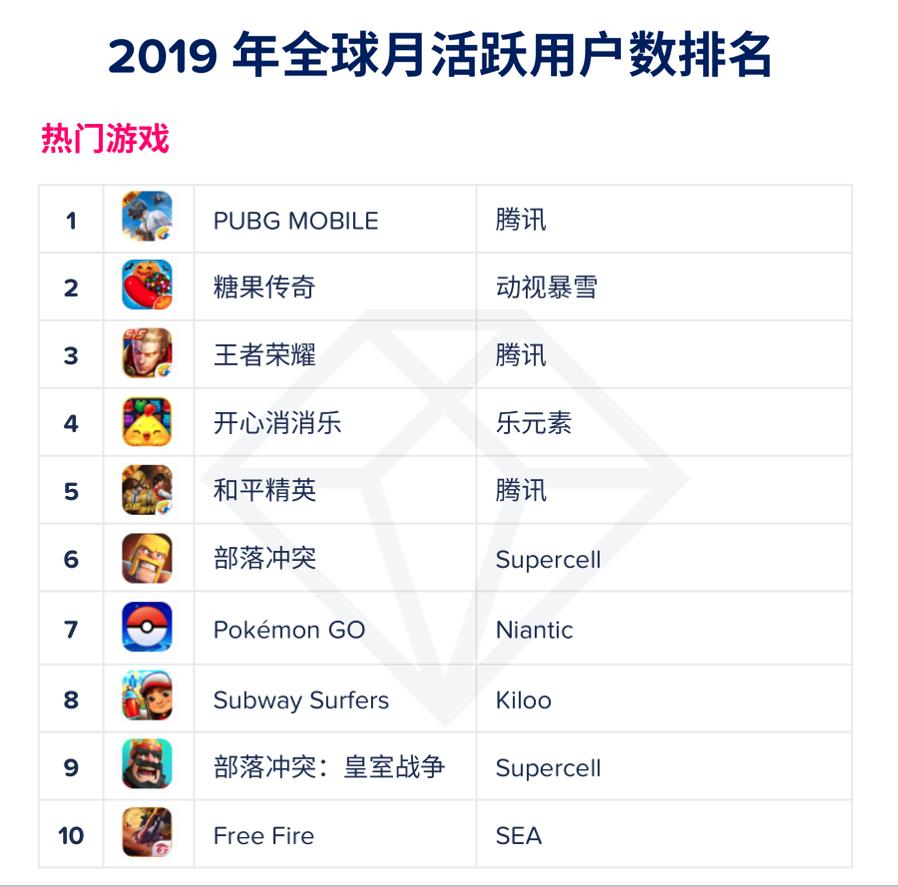

# 游戏分类与热点探索

#### 使用思维导图描述游戏的分类

------

#### 结合手机游戏市场的下载量与排名等数据，结合游戏分类图，描述游戏市场的热点。

​	随着居民生活水平的提高，对于生活娱乐类产业也得到快速提振，而游戏产业作为年轻一代最受欢迎的娱乐种类也得到飞速发展。受到智能手机、平板电脑等便携式智能设备的发展，手游市场得到快速发展，2019年手游市场占据了游戏行业近五成份额。

​	数据公司AppAnnie于2020年1月16日发布的2020移动市场报告显示，2019年全球手游市场规模达到884亿美元，同比增幅接近26%，而且中国手游市场规模在全球大盘占比增加，从一年前的32%，提高至40%。

​	

​	上图为2019年全球手游收入榜前十名，依次是：**《FGO》、《王者荣耀》、《糖果传奇》、《怪物弹珠》、《Pokemon Go》、《天堂M》、《梦幻西游》、《部落冲突》、《PUBG MOBILE》和《龙珠Z激斗》。**

​	上图为2019年全球手游月活跃用户数Top10，它们分别是：**《PUBG MOBILE》、《糖果传奇》、《王者荣耀》、《开心消消乐》、《和平精英》、《部落冲突》、《Pokemon Go》、《地铁跑酷》、《皇室战争》和《Free Fire》。**

​	

​	上图为2019全球手游下载榜，按照下载量依次是：**《Free Fire》、《PUBG MOBILE》、《地铁跑酷》、《Color Bump 3D》、《Fun Race 3D》、《Run Race 3D》、《我的汤姆猫2》、《梦幻家园》、《使命召唤手游》和《Stack Ball》。**

​	

​	根据上述三个图表，我们可以列出如下榜单：

| **游戏名称**              | **用户支出排名** | **月活跃用户数排名** | 下载量排名 | **按游戏方式+内容分类**   |
| ------------------------- | :--------------: | -------------------- | ---------- | ------------------------- |
| Fata/Grand Order          |        1         |                      |            | 角色扮演游戏+卡牌游戏     |
| 王者荣耀                  |        2         | 3                    |            | 动作游戏+格斗游戏         |
| 糖果传奇                  |        3         | 2                    |            | 休闲游戏+消除游戏         |
| 怪物弹珠                  |        4         |                      |            | 角色扮演游戏+射击游戏     |
| Pokemon GO                |        5         | 7                    |            | 角色扮演游戏+养成游戏     |
| 天堂M                     |        6         |                      |            | 角色扮演游戏+战略模拟游戏 |
| 梦幻西游                  |        7         |                      |            | 角色扮演游戏+战略模拟游戏 |
| 部落冲突                  |        8         | 6                    |            | 策略游戏+养成游戏         |
| PUBG MOBILE               |        9         | 1                    | 2          | 角色扮演游戏+射击游戏     |
| Dragon Ball Dokkan Battle |        10        |                      |            | 策略游戏+卡牌游戏         |
| Subway Surfers            |                  | 8                    | 3          | 休闲益智游戏+跑酷游戏     |
| Free Fire                 |                  | 10                   | 1          | 动作游戏+射击游戏         |
| 开心消消乐                |                  | 4                    |            | 休闲游戏+消除游戏         |
| 和平精英                  |                  | 5                    |            | 动作游戏+射击游戏         |
| 部落冲突：皇室战争        |                  | 9                    |            | 策略游戏+卡牌游戏         |
| Color Bump 3D             |                  |                      | 4          | 休闲益智游戏+闯关游戏     |
| Fun Race 3D               |                  |                      | 5          | 休闲益智游戏+竞速游戏     |
| Run Face 3D               |                  |                      | 6          | 休闲益智游戏+跑酷游戏     |
| 我的汤姆猫                |                  |                      | 7          | 休闲游戏+养成游戏         |
| Homescapes                |                  |                      | 8          | 休闲游戏+消除游戏         |
| Call of Duty:Mobile       |                  |                      | 9          | 动作游戏+射击游戏         |
| Stack Ball                |                  |                      | 10         | 休闲游戏+闯关游戏         |

​	对于上述榜单，可以做出的总结如下：

| 按游戏内容分类 | ****用户支出排名上榜数**** | **月活跃用户数排名上榜数** | 下载量排名上榜数 | **总数量** |
| -------------- | -------------------------- | -------------------------- | ---------------- | ---------- |
| 射击游戏       | 2                          | 3                          | 3                | 8          |
| 养成游戏       | 2                          | 2                          | 1                | 5          |
| 消除游戏       | 1                          | 2                          | 1                | 4          |
| 跑酷游戏       | 0                          | 1                          | 2                | 3          |
| 卡牌游戏       | 2                          | 0                          | 0                | 2          |
| 战略模拟游戏   | 2                          | 0                          | 0                | 2          |
| 格斗游戏       | 1                          | 1                          | 0                | 2          |
| 闯关游戏       | 0                          | 0                          | 2                | 2          |
| 竞速游戏       | 0                          | 0                          | 1                | 1          |

​	分析上述总结的数据，可以发现射击类、大逃杀类、养成类、消除类、跑酷类手机游戏更受玩家的青睐。同时关注之前的表格，可以看出休闲益智类、角色扮演类手机游戏的榜单数量远多于其它类型的手机游戏。

​	从收入的角度来看，角色扮演类游戏仍是吸金最多的品类，这主要得益于中国、日本、韩国等东南亚玩家对该品类的偏爱。

​	总体来看，手机市场越来越趋向于随开随玩、并且可以随时关闭的这种快节奏、耗时短的休闲益智类游戏以及结合了新兴的AR、VR技术、可以让玩家玩游戏时身临其境、同时具有很强代入感的角色扮演类游戏。

