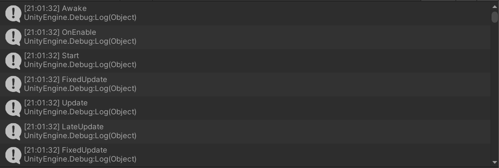

### 1、简答题

- ##### 解释 游戏对象（GameObjects） 和 资源（Assets）的区别与联系。

  ​	**区别：**

  ​		GameObjects是指具体的实例，游戏中的每个对象都是一个GameObject，能够容纳实现实际功能的组件。需要将特殊属性 (special properties)添加到GameObjects上才能使它成为一个物品、一个角色或者某种特殊的效果。

  ​		Assets是指游戏中需要的资源，其中不仅仅包括GameObjects，还有一些C#源代码以及音频、图片等文件。

  ​	**联系：**

  ​		GameObjects是游戏素材资源实例化后的对象；Assets可以作为模板实例化成具体的游戏对象；也可以作为游戏对象中的某种属性，同时添加到多个游戏对象中，被多个游戏对象同时使用。

  

- ##### 下载几个游戏案例，分别总结资源、对象组织的结构（指资源的目录组织结构与游戏对象树的层次结构）

  ​	下载了**愤怒的小鸟**、**类CS游戏**和**ExitRoom**的unity3d设计游戏源码的资源后分析总结如下，以**ExitRoom**的unity3d设计游戏源码为例：

  ​	**资源目录**如下：

  ​	

  可以发现资源目录包括：Fonts、Images、LeanTween(包含了游戏的框架)、Materials(材料)、Prefab(预制)、Scenes(场景)、Scripts(C#代码)、Sprites(对象)等

  

  **游戏对象树的层次结构**如下：

  

  可以发现游戏对象树的层次结构一般包括：Camera(摄像头)、Background(背景)、Light(灯光)和一些自定义对象等，如此例中的：

  ​	游戏管理对象(Manager)：

  ​	Post-process Volume、GameEcentHandler、UIManager、PuzzleManager、GameManager;

  ​	场景对象(SceneObjects):

  ​		Directional Light、Enviroment、Player；

  ​	用户接口(UserInterface):

  ​		Canvas、EventSystem

- ##### 编写一个代码，使用 debug 语句来验证 MonoBehaviour 基本行为或事件触发的条件

  - 基本行为包括 Awake() Start() Update() FixedUpdate() LateUpdate()

  - 常用事件包括 OnGUI() OnDisable() OnEnable()

    首先分析各基本行为及常用事件的作用：

    - `Awake()` 在脚本实例被加载时即被调用
    - `Start()` 仅在Update()函数第一次被调用前调用
    - `Update()` 每一帧都调用一次
    - `FixedUpdate()` 在自设定的帧频下，每一帧调用一次
    - `LateUpdate()` 当Behaviour是enabled时，所有Update()函数调用后被调用
    - `OnGUI()` 当渲染和处理GUI事件时被调用
    - `OnDisable()` 当行为变得无效的时候被调用
    - `OnEnable()` 当对象启用并激活的时候被调用

    将如下代码添加到**Main Camera**对象中：

    ```
    using System.Collections;
    using System.Collections.Generic;
    using UnityEngine;
    
    public class test : MonoBehaviour
    {
        void Start(){
            Debug.Log("Start");
        }
    
    	void Update(){
        	Debug.Log("Update");
    	}
    
    	void Awake()
    	{
       	 	Debug.Log("Awake");
    	}
    
    	void FixedUpdate(){
        	Debug.Log("FixedUpdate");
    	}
    
    	void LateUpdate(){
       		Debug.Log("LateUpdate");
    	}
    
    	void OnGUI(){
        	Debug.Log("OnGUI");
    	}
    
    	void OnDisable(){
        	Debug.Log("OnDisable");
    	}
    
    	void OnEnable(){
        	Debug.Log("OnEnable");
    	}
    
    }
    ```

    运行结果如下：

  

  

- **查找脚本手册，了解GameObject，Transform，Component 对象**

  - 分别翻译官方对三个对象的描述（Description）

    **GameObject**：Unity场景中所有实体的基类

    **Transform：**物体的位置、旋转和比例

    **Component：**所有附加到**GameObject**上的东西的基类

  - 描述下图中 table 对象（实体）的属性、table 的 Transform 的属性、 table 的部件
    - 本题目要求是把可视化图形编程界面与 Unity API 对应起来，当你在 Inspector 面板上每一个内容，应该知道对应 API。

    - 例如：table 的对象是 GameObject，第一个选择框是 activeSelf 属性。

      **table 对象（实体）的属性**: 

      ​	sctiveSelf：该对象是否显示/渲染；

      ​	table：为当前对象名称，可更改；

      ​	Static：选中表示该对象为静态，运行时不移动；

      ​	Tag：对象的标签，可用于分类；

      ​	Layer：对象的层，通常被摄像机用来渲染部分场景，和灯光照射部分场景使用；

      

      **table 的 Transform 的属性**: 

      ​	Position：位置；

      ​	Rotation：旋转角度；

      ​	Scale：缩放比例；

      

      **table 的部件**: 

      ​	含有Transform、Cube、Mesh Renderer、Box Collider等部件

      

  - 用 UML 图描述 三者的关系（请使用 UMLet 14.1.1 stand-alone版本出图）

    

    

- **资源预设（Prefabs）与 对象克隆 (clone)**

  - 预设（Prefabs）有什么好处？
  
    预设有利于资源重用，减少工作量。当需要重复用到一个对象或者需要重复用到一组数据时，我们可以预设一个对象作为模板承担相同的属性，就可以很方便的重复使用这个对象了。
  
  - 预设与对象克隆 (clone or copy or Instantiate of Unity Object) 关系？
  
    预设当中产生的对象与预设的对象是联系的，当修改预设时，它产生出来的对象也会被修改。
    而克隆中，母体和子体是独立的，相互不干扰。
  
  - 制作 table 预制，写一段代码将 table 预制资源实例化成游戏对象
  
    依照课件将制作好的table拖入Assets，将自动生成table预制，结果如下：
    
    
    
    
    
    将 table 预制资源实例化成游戏对象，代码如下：
    
    ```c#
    using System.Collections;
    using System.Collections.Generic;
    using UnityEngine;
    
    public class createTable : MonoBehaviour{
        public GameObject table;
    
        void Start(){
            GameObject temp = (GameObject)Instantiate(table,transform.position,transform.rotation);
            temp.name = "instance";
        }
    
    	void Update(){
    	}
    }
    ```
    
    将createTable添加到Main Camera，并把之前做好的table预制拖入选择框
    
    
    
    运行后效果如下：
    
    
    
    

### 2、 编程实践，小游戏

- **游戏内容： 井字棋 或 贷款计算器 或 简单计算器 等等**
- **技术限制： 仅允许使用 [IMGUI](https://docs.unity3d.com/Manual/GUIScriptingGuide.html) 构建 UI**
- **作业目的：**
  - 了解 OnGUI() 事件，提升 debug 能力

  - 提升阅读 API 文档能力

    **设计原理：**

    reset()函数初始化棋盘；
    OnGUI()函数中编写UI和button的落子；
    is_win()函数通过对角线上三个位置判断是否有一方赢。

    

    **实现功能：**

    实现一个井字棋游戏，任意三个标记“X”或“O“形成一条直线，则为获胜

    

    **代码如下：**

    ```c#
    using System.Collections;
    using System.Collections.Generic;
    using UnityEngine;
    
    public class NewBehaviourScript : MonoBehaviour
    {
    
        private int empty;
        private int turn;
        private int[,] chess = new int[3, 3];
        
        void Start()
        {
            reset();
        }
        
        void reset()
        {
            empty = 9;
            turn = 1;
            for (int i = 0; i < 3; i++)
            {
                for (int j = 0; j < 3; j++)
                {
                    chess[i, j] = 0;
                }
            }
        }
        
        private void OnGUI()
        {
            int result = is_win();
        
            GUI.skin.button.fontSize = 60;
            GUI.skin.label.fontSize = 30;
        
            if (GUI.Button(new Rect(150, 200, 200, 80), "Reset"))
            {
                reset();
            }
        
            if (result == 1)
            {
                GUI.Label(new Rect(500, 20, 100, 50), "X wins");
            }
            else if (result == 2)
            {
                GUI.Label(new Rect(500, 20, 100, 50), "O wins");
            }
            else if (result == 3)
            {
                GUI.Label(new Rect(470, 20, 200, 50), "It's a draw");
            }
        
            for (int i = 0; i < 3; i++)
            {
                for (int j = 0; j < 3; j++)
                {
                    if (chess[i, j] == 1)
                    {
                        GUI.Button(new Rect(i * 100 + 400, j * 100 + 80, 100, 100), "X");
                    }
                    if (chess[i, j] == 2)
                    {
                        GUI.Button(new Rect(i * 100 + 400, j * 100 + 80, 100, 100), "O");
                    }
                    if (GUI.Button(new Rect(i * 100 + 400, j * 100 + 80, 100, 100), ""))
                    {
                        if (result == 0)
                        {
                            if (turn == 1) chess[i, j] = 1;
                            if (turn == 2) chess[i, j] = 2;
                            empty--;
                            if (empty % 2 == 1)
                            {
                                turn = 1;
                            }
                            else
                            {
                                turn = 2;
                            }
                        }
                    }
                }
            }
        }
        
        int is_win()
        {
            int win = chess[0, 0];
            if (win != 0)
            {
                if (win == chess[0, 1] && win == chess[0, 2])
                {
                    return win;
                }
                if (win == chess[1, 0] && win == chess[2, 0])
                {
                    return win;
                }
            }
        
            win = chess[2, 2];
            if (win != 0)
            {
                if (win == chess[2, 0] && win == chess[2, 1])
                {
                    return win;
                }
                if (win == chess[0, 2] && win == chess[1, 2])
                {
                    return win;
                }
            }
        
            win = chess[1, 1];
            if (win != 0)
            {
                if (win == chess[0, 0] && win == chess[2, 2])
                {
                    return win;
                }
                if (win == chess[0, 2] && win == chess[2, 0])
                {
                    return win;
                }
                if (win == chess[0, 1] && win == chess[2, 1])
                {
                    return win;
                }
                if (win == chess[1, 0] && win == chess[1, 2])
                {
                    return win;
                }
            }
        
            if (empty == 0)
            {
                return 3;
            }
            else
            {
                return 0;
            }
        }
    
    }
    ```

    

    **运行测试结果如下：**

    

    

### 3、思考题【选做】

- **微软 XNA 引擎的 Game 对象屏蔽了游戏循环的细节，并使用一组虚方法让继承者完成它们，我们称这种设计为“模板方法模式”。**
  
  - 为什么是“模板方法”模式而不是“策略模式”呢？
  
    **模板方法模式：**定义一个操作中的算法的骨架，而将一些步骤延迟到子类中；模板方法更接近于一项规则，为程序的算法规定一套流程也就是模板，代码需要遵循这个模板来编写，通过修改流程每个部分内部的实现来改变功能。
    **策略模式**：定义一系列的算法,把它们一个个封装起来, 并且使它们可相互替换。它更强调的是内部变化与外部的分离，及内部的修改不会影响到外部其他部分的功能。
- **将游戏对象组成树型结构，每个节点都是游戏对象（或数）。**
  
  - 尝试解释组合模式（Composite Pattern / 一种设计模式）。
  
    **组合模式**，又叫部分整体模式，是用于把一组相似的对象当作一个单一的对象。组合模式依据树形结构来组合对象，用来表示部分以及整体层次。这种类型的设计模式属于结构型模式，它创建了对象组的树形结构。
  
    组合模式使得用户对单个对象和组合对象的使用具有一致性。
  
  - 使用 BroadcastMessage() 方法，向子对象发送消息。你能写出 BroadcastMessage() 的伪代码吗?
  
    ```c#
    void BoradcastMessage(string message) {
        foreach (child of this) {
            Debug.Log(message);
        }
    }
    ```
  
    
- **一个游戏对象用许多部件描述不同方面的特征。我们设计坦克（Tank）游戏对象不是继承于GameObject对象，而是 GameObject 添加一组行为部件（Component）。**

  - 这是什么设计模式？

    **桥接(Bridge)模式**

  - 为什么不用继承设计特殊的游戏对象？

    1. 继承过多容易导致类与类之间结构不明晰
    2. 继承具有较高的耦合度、灵活性不高，父类游戏对象发生改变时子类也会跟着变
    3. 桥接模式耦合度低，当部分功能被修改时，不会影响到外部其他部件的功能。

